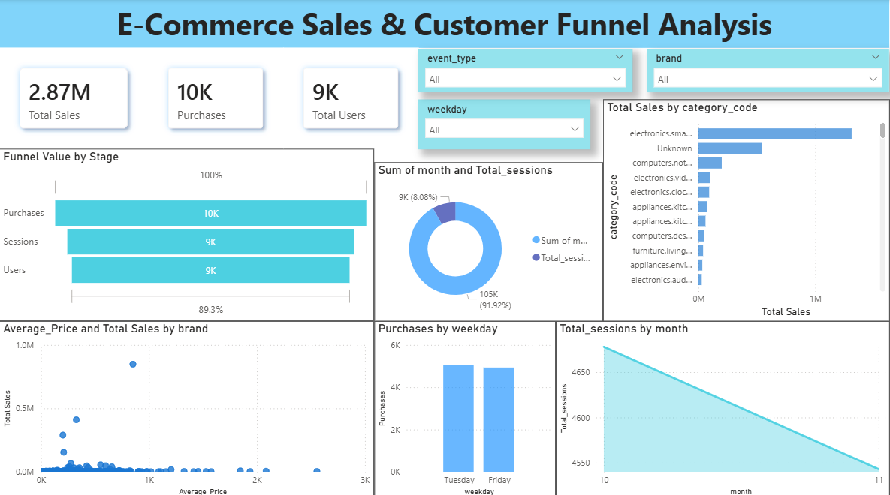

# 📊 E-Commerce Sales & Customer Funnel Analysis Dashboard

An interactive and insightful **Power BI Dashboard** designed to analyze e-commerce sales performance, customer behavior, and conversion funnel metrics. This project helps businesses make data-driven decisions by identifying trends, top-performing categories, and customer engagement patterns.

---

# 🚀 Project Overview

The **E-Commerce Sales & Customer Funnel Analysis Dashboard** provides a complete overview of:

* Sales Performance
* Customer Funnel Stages
* Brand Analysis
* Category-wise Revenue
* User Sessions
* Purchase Trends
* Monthly Activity Monitoring

The dashboard enables businesses to understand how users move through the sales funnel and where optimization opportunities exist.

---

# 📸 Dashboard Preview

<p align="center">
  
</p>

---

# 📌 Key Dashboard Metrics

| Metric         | Value |
| -------------- | ----- |
| 💰 Total Sales | 2.87M |
| 🛒 Purchases   | 10K   |
| 👥 Total Users | 9K    |

---

# 📊 Dashboard Features

## 🔹 Customer Funnel Analysis

Tracks the customer journey across:

* Users
* Sessions
* Purchases

Helps identify conversion performance and customer drop-offs.

---

## 🔹 Category-wise Sales Analysis

Displays sales contribution from different product categories such as:

* Electronics
* Computers
* Appliances
* Furniture

Used to identify top-performing product segments.

---

## 🔹 Brand Performance Insights

Scatter plot visualization comparing:

* Average Product Price
* Total Sales by Brand

Helps analyze premium vs high-volume brands.

---

## 🔹 Purchase Trends by Weekday

Visualizes purchase activity across weekdays to determine:

* Peak purchase days
* Customer buying behavior

---

## 🔹 Monthly Session Analysis

Tracks customer session trends over months to monitor:

* Website traffic
* User engagement patterns

---

## 🔹 Interactive Filters

Dashboard includes slicers for:

* Event Type
* Brand
* Weekday

Providing dynamic and customized analysis.

---

# 🛠️ Technologies Used

## 📌 Power BI

* Dashboard Development
* Data Visualization
* Data Modeling
* DAX Calculations

## 📌 Python

Used for:

* Data Cleaning
* Data Preprocessing
* Exploratory Data Analysis (EDA)

### Python Libraries Used

```python
pandas
numpy
matplotlib
seaborn
```

## 📌 Jupyter Notebook

Used for:

* Cleaning raw datasets
* Data transformation
* Initial analysis

---

# 📂 Project Structure

```bash
📁 E-Commerce-Sales-Customer-Funnel-Analysis
│
├── 📄 README.md
├── 📄 funnel_analysis.ipynb
├── 📄 FunnelAnalysis_Dashboard.pbix
├── 📄 cleaned_marketing_funnel.csv
├── 📷 FunnelAnalysis_dashboard.png
```

---

# 📈 Key Insights

* Electronics products generated the highest revenue.
* Purchases were highest on Tuesdays and Fridays.
* Strong funnel conversion observed from sessions to purchases.
* Certain brands showed high sales despite moderate pricing.
* Monthly user sessions showed a gradual decline.

---

# 🎯 Business Benefits

This dashboard helps businesses:

* Improve conversion strategies
* Monitor customer engagement
* Identify profitable product categories
* Optimize marketing campaigns
* Support business intelligence reporting

---

# ▶️ How to Use

1. Clone or download the repository
2. Open the `.pbix` file using Power BI Desktop
3. Explore dashboard visuals and filters
4. Connect your own dataset if needed

---

# 📚 Learning Outcomes

Through this project, I learned:

* Interactive Dashboard Development
* Customer Funnel Analysis
* Business Intelligence Reporting
* Data Cleaning Techniques
* Data Visualization Best Practices
* DAX Calculations in Power BI

---

# ⭐ Support

If you found this project useful, give this repository a ⭐ on GitHub.
